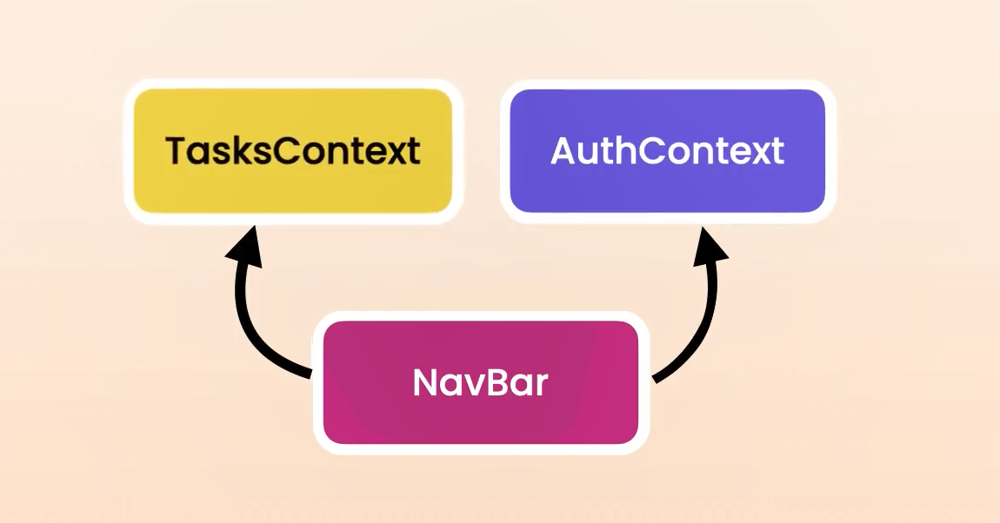
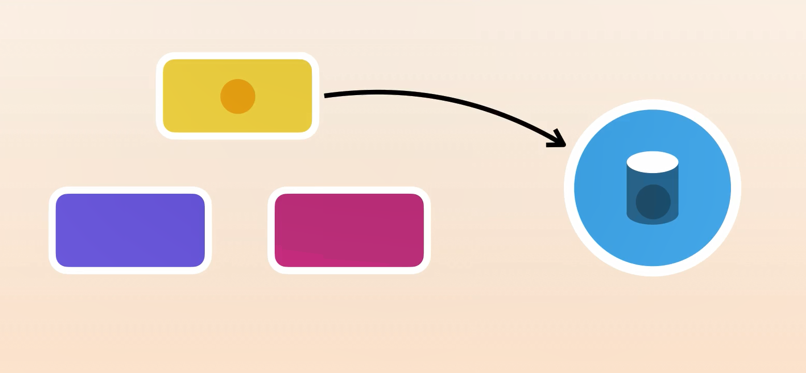

# Global State Management

## Content

- Consolidating State Logic with a Reducer!!
<!-- idk why i put that here -->

## Keywords

- State/actions
- Context / Prop drilling
- React.createContext / TasksContext.provider
- Redux / Zustand

# Consolidating State Logic with a Reducer

A reducer is a function that allows us to centralize state updates in a component.

The name may be a little bit confusing but the underline concept is actually very simple, here's a counter component to see reducers in actions.

A reducer function should have 2 parameters, a state and an action, an action is an object that describe what the user is trying to do, so the reducer take the current state of an action an return the new state.

```tsx
// inside folder reducers: file: counterReducer.tsx
// properties needs to be annotated, the state var type is the same as
// our original state, and the type of action has no specific type
// but with convention we use an object with a type property that describes the action

interface Action {
  type: string;
}
// PS: annotate the function to detect
// potential errors when returning a value
const counterReducer = (state: number, action: Action): number => {
  if (action.type === "INCREMENT") return state + 1;
  if (action.type === "RESET") return 0;
  return state;
};

export default counterReducer;
```

PS: when the action is a different type, there is 2 solutions, some people argue that we should return the same state, others argue that we should throw an error saying "Action not supported". With type script we can prevent invalid actions so throwing an error is not really necessary

Back to our counter component, we use the reducer hook taht is defined in react, we call it and we give it 2 arguments:

- 1st arg: a reducer function.
- 2nd arg: the initial state.

similair to the state hook, this hook return an arry with 2 elements:

- 1st elem: current state.
- 2nd elem: a function for triggering changes, called dispatch.

By dispatching an action, you're telling react that the user is trying to increament/reset the counter, at that momment react will call the reducer and pass the current state as well as the action that we just dispatch, within the reducer we check the action and return the next state back to our component.

```tsx
import { useReducer, useState } from "react";
import counterReducer from "./reducers/counterReducer";

const Counter = () => {
  // const [value, setValue] = useState(0);
  const [value, dispatch] = useReducer(counterReducer, 0);

  return (
    <div>
      Counter ({value})
      <button
        onClick={() => dispatch({ type: "INCREMENT" })}
        className="btn btn-primary mx-1"
      >
        Increment
      </button>
      <button
        onClick={() => dispatch({ type: "RESET" })}
        className="btn btn-primary mx-1"
      >
        Reset
      </button>
    </div>
  );
};

export default Counter;
```

Now we have an issue, if we have a typo our code won't work correctly, but in ts it's very easy to fix, back to our reducer module, we can change the type of the action from string to a union of literal value, we can say the type can only be "INCREMENT or "RESET". if we set the type to any other values, the ts compiler will yell at us, that' why we said that with TS we don't need to throw an error.

```tsx
interface Action {
  type: "INCREMENT" | "RESET";
}
```

Now all of the state management logic is encapsulated inside this reducer function, our component is purely responsible for the markup, we have a good separation of concerns and we can potentially reuse this reducer with another component that works with the counter.

Here's the final code for our reducer:

```tsx
interface Action {
  type: "INCREMENT" | "RESET";
}

const counterReducer = (state: number, action: Action): number => {
  if (action.type === "INCREMENT") return state + 1;
  if (action.type === "RESET") return 0;
  return state;
};

export default counterReducer;
```

# Creating Complex Actions

Let's see a more complex example of an action that require extra data or payload, check the TaskList component inside the Global state management folder, we can centrelized and consalidate our state managment logic inside a reducer.

First we make a new reducer called **tasksReducer** inside our reducers folder. inside it we'll make an Action interface.

The problem here is we can't make a property of type Task because it only makes sense when adding a task, when deleting a task we don't need a task property but a task id. The Solution is to define different types of actions for various scenarios.

```tsx
// we defined two interfaces to cover both type of actions
// like that each interface has a different type of payload
interface AddTask {
  type: "ADD";
  task: Task;
}
interface DeleteTask {
  type: "DELETE";
  taskId: number;
}

// we define a type called Action which is a union of the two interfaces.
// so the action can be either AddTask or DeleteTask
type Action = AddTask | DeleteTask;
```

PS: we should annotate our reducer with its return type, so if you made a mistake, the TS compiler will complain.

```tsx
//
// tasksReducer
//
// we moved this interface from the component to our reducer
interface Task {
  id: number;
  title: string;
}

// we defined two interfaces to cover both type of actions
// like that each interface has a different type of payload
interface AddTask {
  type: "ADD";
  task: Task;
}
interface DeleteTask {
  type: "DELETE";
  taskId: number;
}
type Action = AddTask | DeleteTask;

// we renamed "state" to "tasks" for clarity
const taskReducer = (tasks: Task[], action: Action): Task[] => {
  // we used a switch statement instead o bunch of if statements
  switch (action.type) {
    case "ADD":
      return [action.task, ...tasks];
    case "DELETE":
      return tasks.filter((task) => action.taskId !== task.id);
    // when you use the dot operator to look at the properties of action
    // we only see taskId and type, and not the task property, bcs in
    // this context, the TS compiler knows that we're dealing with
    // a DeleteTask interface
    // same thing for the above case, TS compiler will know that we're
    // dealing with a AddTask interface

    default:
      return tasks;
  }
};

export default taskReducer;
```

```tsx
//
// taskList component
//
import { useReducer } from "react";
import taskReducer from "./reducers/tasksReducer";

const TaskList = () => {
  const [tasks, dispatch] = useReducer(taskReducer, []);

  return (
    <>
      <button
        onClick={() =>
          dispatch({
            type: "ADD",
            task: { id: Date.now(), title: "Task " + Date.now() },
          })
        }
        className="btn btn-primary my-3"
      >
        Add Task
      </button>
      <ul className="list-group">
        {tasks.map((task) => (
          <li
            key={task.id}
            className="list-group-item d-flex justify-content-between align-items-center"
          >
            <span className="flex-grow-1">{task.title}</span>
            <button
              className="btn btn-outline-danger"
              onClick={() =>
                dispatch({
                  type: "DELETE",
                  taskId: task.id,
                })
              }
            >
              Delete
            </button>
          </li>
        ))}
      </ul>
    </>
  );
};

export default TaskList;
```

# Exercice: working with Reducers

```tsx
// logInReducer
interface LogIn {
  type: "LOGIN";
  user: string;
}

interface LogOut {
  type: "LOGOUT";
}

type LogAction = LogIn | LogOut;

const AuthReducer = (state: string, action: LogAction): string => {
  if (action.type === "LOGIN") return action.user;
  if (action.type === "LOGOUT") return "";
  return "";
};

export default AuthReducer;
```

```tsx
import { useReducer } from "react";
import AuthReducer from "./reducers/logInReducer";

const LoginStatus = () => {
  // const [user, setUser] = useState("");
  const [user, dispatch] = useReducer(AuthReducer, "");

  if (user)
    return (
      <>
        <div>
          <span className="mx-2">{user}</span>
          <a onClick={() => dispatch({ type: "LOGOUT" })} href="#">
            Logout
          </a>
        </div>
      </>
    );
  return (
    <div>
      <a
        onClick={() => dispatch({ type: "LOGIN", user: "mosh.hamedani" })}
        href="#"
      >
        Login
      </a>
    </div>
  );
};

export default LoginStatus;
```

# Sharing State using Context

In order to share a state between componenets, we need to lift the state up to the closest parent and pass it down as props to child components.

There is an issue with this, as our components tree grow bigger and more complex, we have to pass data through many components in the middle, this is called **`Prop drilling`** it's like we're drilling holes through a bunch of components just to pass data to the children, this is where we can use **`react context`**, with context we can share data without having to pass it down through many components in the middle, so our code will be cleaner and more maintaainable.

Let's see it in action. Both the state and reducer hooks are ways to maintain a state in a component. In the TaskList, if we want to share this state we have to lift it up to the app component and then share it with the components using a context.

`React Context:` it's like a truck for transporting a box, inside that box we can have some states. but first you're gonna define the shape of that box.

First we add this line to the app component, then we create a folder called **context**, and add a file called **tasksContext.ts**.

```tsx
const [tasks, dispatch] = useReducer(taskReducer, []);
```

Now let's define the shape of our context, we're gonna provide both of **tasks** and **dispatch** objects so we can manipulate tasks in our TaskList component.

```tsx
import { Dispatch } from "react";
import { Task } from "../reducer/taskReducer";

interface TaskContextType {
  tasks: Task[];
  dispatch: Dispatch<TaskAction>;
  // that's the object taht we're going to transport using react context
}
```

PS: Dispatch is a type that is defined in react that represent a function that takes an argument of type `A` (which is a generic type parameter) an returns void.

After defining the interface, we call **`React.createContext`** and provide the type of objects that we wanna share (in this case TaskContextType). we give it a default value, most of the time it's not needed so we have 2 options:

- we can pass null but we have to make the type _TaskContextType_ or null which doesn't make sense since here we wanna define the type of objects we wanna share, it doesn't make sense to share null.

- the other option is to pass an empty object and use **as** keyword to tell TS compiler to treat that object as an instance of TaskContextType.

```tsx
// using this line we create a context which is a type
// so we defined a constant called _taskContext_
const TaskContext = React.createContext<TaskContextType>({} as TaskContextType);

// don't forget to export it
export default TaskContext;
```

back to our app component where we have our local state (tasks, dispatch), after adding the Navigation bar and Home Page component, we use our context to share the **tasks** and **dispatch** function in our component tree.

we wrap our 2 components with a **`TasksContext.provider`** and we supply it with a value, that value will replace the default value that we supplied in the **tasksContext.ts** file where we created the context, that's why most of the time we don't need a value there.

Now we should pass an object, in that object we should add an array of tasks and the dispatch function. Now this **context** is like the truck transporting this box, we can access this box (the { tasks, dispatch } object) anywhere in our component tree using the context hook.

```tsx
import "./App.css";
import HomePage from "./routing/HomePage";
import NavBar from "./routing/NavBar";

function App() {
  const [tasks, dispatch] = useReducer(taskReducer, []);

  return (
    // no need for fragment since we're using a context
    <TasksContext.provider value={{ tasks, dispatch }}>
      <NavBar />
      <HomePage />
    </TasksContext.provider>
  );
}

export default App;
```

To see that in action, let's go back to our TaskList component, here we need the dispatch function, and the tasks array, so we use the **`Context hook`** that is defined in react and provide the type of context which **TasksContext** here.

That returns a **context** object that has 2 properties (dispatch and tasks) so that is the box that u'r accessing in that component, now we can destructure it to grab these 2 properties, now the rest of the code is exactly like before. But we shared our tasks and dispatch object without props drilling.

```tsx
import TaskContext from "./contexts/TasksContext";

// context object contains both dispatch and tasks objects
// const context = useContext(TaskContext);

const { tasks, dispatch } = useContext(TaskContext);
// ...
// ..
// .
```

using the same technique we can go to the navigaton bar and access our tasks array. here's the full code for our components:

```tsx
// TasksContext.ts file
import { createContext } from "react";
import { Task, TaskAction } from "../reducers/tasksReducer";

interface TasksContextType {
  tasks: Task[];
  dispatch: React.Dispatch<TaskAction>;
}

const TasksContext = createContext({} as TasksContextType);

export default TasksContext;
```

```tsx
// App component
import { useReducer } from "react";
import "./App.css";
import TaskContext from "./state-management/contexts/TasksContext";
import taskReducer from "./state-management/reducers/tasksReducer";
import HomePage from "./state-management/HomePage";
import NavBar from "./state-management/NavBar";

function App() {
  const [tasks, dispatch] = useReducer(taskReducer, []);

  return (
    <TaskContext.Provider value={{ tasks, dispatch }}>
      <NavBar />
      <HomePage />
    </TaskContext.Provider>
  );
}

export default App;
```

```tsx
// TaskList component
import { useContext } from "react";
import TaskContext from "./contexts/TasksContext";

const TaskList = () => {
  // const [tasks, dispatch] = useReducer(taskReducer, []);
  const { tasks, dispatch } = useContext(TaskContext);

// the rest is the same
// ...
// ..
// .
```

# 44 - Exercice: Working with Context.mp4

```tsx
import { useReducer } from "react";
import "./App.css";
import TaskContext from "./state-management/contexts/TasksContext";
import HomePage from "./state-management/HomePage";
import NavBar from "./state-management/NavBar";
import taskReducer from "./state-management/reducers/tasksReducer";
import AuthReducer from "./state-management/reducers/logInReducer";
import AuthContext from "./state-management/contexts/userContext";

function App() {
  const [tasks, tasksDispatch] = useReducer(taskReducer, []);
  const [user, authDispatch] = useReducer(AuthReducer, "");

  return (
    <TaskContext.Provider value={{ tasks, dispatch: tasksDispatch }}>
      <AuthContext.Provider value={{ user, dispatch: authDispatch }}>
        <NavBar />
        <HomePage />
      </AuthContext.Provider>
    </TaskContext.Provider>
  );
}

export default App;
```

```tsx
// LoginStatus.tsx file
import { useContext } from "react";
import AuthContext from "./contexts/UserContext";

const LoginStatus = () => {
  // const [user, setUser] = useState("");
  // const [user, dispatch] = useReducer(AuthReducer, "");
  const { user, dispatch } = useContext(AuthContext);

  if (user)
    return (
      <>
        <div>
          <span className="mx-2">{user}</span>
          <a onClick={() => dispatch({ type: "LOGOUT" })} href="#">
            Logout
          </a>
        </div>
      </>
    );
  return (
    <div>
      <a
        onClick={() => dispatch({ type: "LOGIN", user: "mosh.hamedani" })}
        href="#"
      >
        Login
      </a>
    </div>
  );
};

export default LoginStatus;
```

# Debuggin with React dev tools

You can see the state of your context using react dev tool, all you have to do is open the component tab in the chrome dev tools, on the top of the components tree you have three contexts,all of them belongs to reactQuery, this is how reactQuery provide query clients and other objects to our components, bellow that we have our app component, and inside we have two context, you can see its values by clicking on them and look at the props at the right side, you can expand the value to check the dispatch and state objects.

# Creating a Custom Provider

In the app component we're maintaining 2 types of states, the list of tasks and the current user, because of this implementation we had to rename our dispatch functions and give them unique names which is a little bit ugly, here's how we can make it cleaner and more modular.

We're going to move the Auth piece of state into a custom provider component, create a new file called _AuthProvider.tsx_, this is the same pattern that you see in react query and many other libraries, here we create a new component to maintain the current user so we move that piece of state from the app component into our new component, now we should return an **AuthContext.provider** and set it's value with an object with two properties (user and our dispatch function).

In between these tags we should include the rest of our component tree as childs.

```tsx
// AuthProvider.tsx
import { ReactNode, useReducer } from "react";
import AuthReducer from "../reducers/logInReducer";
import AuthContext from "../contexts/UserContext";

interface Props {
  children: ReactNode;
}

const AuthProvider = ({ children }: Props) => {
  // we can rename it into dispatch because it's the only dispatch func
  const [user, dispatch] = useReducer(AuthReducer, "");
  return (
    <AuthContext.Provider value={{ user, dispatch }}>
      {children}
    </AuthContext.Provider>
  );
};

export default AuthProvider;

//
// TaskProvider.tsx
import { ReactNode, useReducer } from "react";
import taskReducer from "../reducers/tasksReducer";
import TasksContext from "../contexts/TasksContext";

interface Props {
  children: ReactNode;
}
function TaskProvider({ children }: Props) {
  const [tasks, dispatch] = useReducer(taskReducer, []);

  return (
    <TasksContext.Provider value={{ tasks, dispatch }}>
      {children}
    </TasksContext.Provider>
  );
}

export default TaskProvider;
```

PS: i did add **TaskProvider** too.

in our app component we replace the old AuthContext with our custom provider.

```tsx
// App.tsx
import "./App.css";
import HomePage from "./state-management/HomePage";
import NavBar from "./state-management/NavBar";
import AuthProvider from "./state-management/providers/AuthProvider";
import TaskProvider from "./state-management/providers/TaskProvider";

function App() {
  return (
    <TaskProvider>
      <AuthProvider>
        <NavBar />
        <HomePage />
      </AuthProvider>
    </TaskProvider>
  );
}

export default App;
```

With this implementation our code is cleaner, more modular and reusable, if we decide to move that Auth provider somewhere else in our components tree or different application, we can simply grab everything here and move it around, so that component has both the state and the context provider

# Creating a Hook to Access Context

Just like we can create a custom provider, we can create a custom hook for accessing a given context, we have seen this technique before in react qeury and probably many other libraries, in react query we have custom hook caled QueryClient to access the shared query client, we can use the same technique here to access the **AuthContext**.

We first add a new folder called **hooks** with a new file called **useAuth.ts**, we define a function whcih in its body we call the Context hook and provide **AuthContext**.

Back to our **LoginStatus** and replace useContext with **useAuth**, with this implementation we don't have to think about a particualr context, we simply use our hook to get the shared objects, with that we can clean up our import statement.

```tsx
// Auth Hook (useAuth.ts)
import { useContext } from "react";
import AuthContext from "../contexts/UserContext";

const useAuth = () => useContext(AuthContext);

export default useAuth;
```

```tsx
// LoginStatus component
import useAuth from "./hooks/useAuth";

const LoginStatus = () => {
  const { user, dispatch } = useAuth();
  // ...
  // ...
```

# Exercice: Creating a Provider

PS: Already did that in the first exercice (Check: Creating a Custom Provider)

# Organizing Code for Scalability and Maintainability

Let's talk about how we can organize our code to make it more scalable and maintainable. Currently, we have different building blocks to work with tasks: a context, a custom hook, a reducer, and two components—TaskList and TasksProvider. These building blocks are closely related, but they're scattered throughout our project. To make our code more modular and maintainable, we should encapsulate them within a module or a package, meaning a directory.

Let me give you an analogy. You don't want your kitchenware to be scattered across different rooms in your house, right? Instead, you keep them all together in your kitchen, where they're easily accessible and organized. Similarly, we want to keep all the elements for working with tasks in one place by encapsulating them within a module or a package. This way, we can easily import and use them in different parts of our application. This also makes our code more** modular, scalable, and maintainable.**

So now we want to move all these building blocks to a single folder called "tasks." Let's add a new folder here called "tasks" and then move these one by one. So here's our reducer. Let's move it and update the import. Next, we move our custom hook. Then we move our context, And finally, the two components TaskList and TasksProvider.

```cmd
<!-- package or module structure -->
- tasks
  |_ TaskList.tsx
  |_ tasksContext.ts
  |_ TasksProvider.tsx
  |_ tasksReducer.ts
  |_ useTasks.ts
```

So now all the building blocks for working with tasks are in a single place, but we are not done yet. If you have seen my other courses, you have probably heard me talking about the design of a remote control. That's one of my favorite examples. A remote control has a bunch of buttons on the outside and a complex electronic board on the inside. What is inside is irrelevant to us as the users or consumers of our remote control. All we care about are the buttons on the outside. With this design, the manufacturer of a remote control can easily change the internals without affecting us, as long as all those buttons we are used to are still on the outside. These buttons represent the public interface of a remote control. What is inside is called an **implementation detail**.

Now we want to apply this principle to our tasks package, so we want to hide certain pieces that are about implementation and expose only the parts that the consumers need. Pthink about it for a minute: What pieces or what building blocks are implementation details?

Here's the answer: In this package, we only need to expose two files, TaskList and TasksProvider. These are the components that we need to import in other parts of our application; everything else is considered implementation detail.

For example, the tasks reducer. In this reducer file, we have the logic for managing the state of our tasks. The only place where we have used this is in our provider. This is the only place where we use this reducer. If we import the TasksProvider component somewhere else in the application, we don't need to work with this reducer directly. So to take this application to the next level, I'm going to go into this reducer file and bring all the code into the TasksProvider file. Let's go to the tasks reducer, select all the code, cut it, and then put it in TasksProvider. Now, paste all the code before the props interface because I want this interface to be close to this component. So let's paste the code. Now we don't need to export the tasks reducer.

```tsx
// TasksProvider.tsx
import { ReactNode, useReducer } from "react";
import TasksContext from "./TasksContext";

// we moved this interface from the component to our reducer
export interface Task {
  id: number;
  title: string;
}

// we defined two interfaces to cover both type of actions
// like that each interface has a different type of payload
interface AddTask {
  type: "ADD";
  task: Task;
}
interface DeleteTask {
  type: "DELETE";
  taskId: number;
}
export type TaskAction = AddTask | DeleteTask;

// we renamed "state" to "tasks" for clarity
const taskReducer = (tasks: Task[], action: TaskAction): Task[] => {
  // we used a switch statement instead o bunch of if statements
  switch (action.type) {
    case "ADD":
      return [action.task, ...tasks];
    case "DELETE":
      return tasks.filter((task) => action.taskId !== task.id);

    default:
      return tasks;
  }
};

// no need to export taskReducer
// export default taskReducer;

interface Props {
  children: ReactNode;
}
function TaskProvider({ children }: Props) {
  const [tasks, dispatch] = useReducer(taskReducer, []);

  return (
    <TasksContext.Provider value={{ tasks, dispatch }}>
      {children}
    </TasksContext.Provider>
  );
}

export default TaskProvider;
```

So in this module, we have all the building blocks for managing the state of tasks. Some of these building blocks are private because we haven't exported them. The other parts are public, like **TaskActionType** as well as **TasksProvider**. Here, we have a compilation error at the top. Let's take a look. We're trying to import tasksReducer. This line is no longer needed. Now for our context, we should import it from the current directory. Also, we don't need to import React. Good. Now you can delete the tasksReducer file.

Okay, so we're done with this module. Now let's talk about our custom hook for accessing tasks. Currently, the only place where we need this hook is inside the TaskList component, right here. So we don't need to define this hook in a separate file and then import it; we can simply grab the line where we define the **useContext** and implement it in the TaskList component. Now, we wouldn't do this if there were other components that used this hook. This is based on our current implementation. There is no **`one-size-fits-all`** solution. That's what I want you to take away from this lesson. We don't want to follow a particular structure as a best practice and apply it to every project.

So let's move on. we need to import the context hook and TasksContext in TaskList component. With this, we don't need the **useTasks** file anymore, we'll delete it and simplify our project structure. we're also importing the **useTasks** hook, Let's remove this line as well.

```tsx
import { useContext } from "react";
import TasksContext from "./TasksContext";

const useTasks = () => useContext(TaskContext);

const TaskList = () => {
  const { tasks, dispatch } = useTasks();

  //...
  //...
  //...
};

export default TaskList;
```

Now, with this structure, you might argue that it will be harder to find these building blocks. Previously, we used **Command + P** on Mac or **Control + P** on Windows to look up a file by its name, like taskReducer, but that reducer is not in a separate file now. So how can we find it? Very easily. Instead of **Command + P**, we use **Command + T**. With this, we can look up any symbol in our project. Here, we can look up **taskReducer** or **useTasks**.

Okay, now let's build our project to make sure we haven't broken anything. So we bring up the command palette and build with `npm run build`.

We have three errors that we have to fix. One error is in TasksContext on line three. Let's go there. Now we should import these types from TasksProvider.

```ts
import { Task, TaskAction } from "./taskReducer";
```

Now let's look at the next error. The next one is in App.tsx. Here, we need to import TasksProvider, but there is a better solution for this. Instead of directly importing the `TasksProvider`, we want to add an index file to our package. we create **index.ts** and expose the parts that represent only the public interface of this package. We need to import **TasksProvider** and then export it. Similarly, we need to import **TaskList** and then export it.

```tsx
import { TaskProvider } from "./TaskProvider";
import { TaskList } from "./TaskList";

export { TaskProvider };
export { TaskList };
```

There is a better way to do this. We can combine these import and export statements. So instead of importing TasksProvider and then exporting it, we can import and export it in one go.

```tsx
export { default as TaskProvider } from "./TaskProvider";
export { default as TaskList } from "./TaskList";
```

Okay, so this is the index of our package. Now back to our App component. We delete the import statement and import **TasksProvider** from "state-management/tasks." Here, we have another error for importing the reducer, but that is not needed, so let's us just organize our imports, Now, let's build our application one more time to make sure we haven't broken anything.

So with this structure, we are not exposing the implementation details of the tasks package. That means if we decide to change the implementation in the future, we only need to modify the code in this package. Our changes are not going to impact the rest of the application. For example, if we go into the TasksProvider and decide to replace this reducer with something else, we only need to modify this file and potentially a few other files in this package. Other parts of our application will not be affected because they don't care how we manage the state internally. Are we using the reducer row? Are we using the state code? Are we using a state management library? All of this is implementation detail and shouldn't be exposed outside of this package.

## Summary

The tutorial explains how to organize code by encapsulating related components, hooks, and reducers into a single module or package to make the code more modular, scalable, and maintainable. The key steps include:

1. **Moving Related Files:** All files related to tasks (context, custom hook, reducer, and components) are moved into a single "tasks" folder.
2. **Combining Reducer and Provider:** The reducer code is moved into the `TasksProvider` file, making it an internal implementation detail that doesn't need to be exported or accessed elsewhere.

3. **Simplifying Hook Usage:** The custom hook, previously in a separate file, is integrated directly into the `TaskList` component since it’s only used there.

4. **Creating an Index File:** An `index.ts` file is added to the package to expose only the necessary components (`TasksProvider` and `TaskList`) as the public interface, while keeping other implementation details hidden.

**End Result:** The code is now more organized, with all task-related components in one folder, and only the necessary parts are exposed for use in other parts of the application. This structure makes future changes easier and ensures the rest of the application is unaffected by internal modifications.

# Exercice: Organizing Code

Put all the buillding blocks for working the current user in a folder called Auth. also with the counter.

# Splitting Contexts for Efficiency

One thing you need to know about context is every time you change something in a context, all component that use that context will rerender, and that brings us to a very important lesson.

A Context should only hold values that are closely related and tend to change together. in other words, a context should have a single responsibility or a single purpose.

Here's an example: currently, we have two contexts, tasks and auth context.



Our navigation component is dependent on both of these contexts and will re-render whenever either the current user or the number of tasks changes. Now, for a second, imagine that we don't want to show the number of tasks on the navigation bar, so our nav bar shouldn't use the tasks context. With this, it will only re-render if the current user changes. However, if we combine these two contexts into a single one, our nav bar will re-render anytime the current user or the tasks change. This is completely unnecessary.

So to minimize unnecessary re-renders, we should split up our contexts into smaller and more focused ones, each having a single responsibility. That's why here we need two separate contexts for sharing tasks and the current user.

Now, as I always say, too much of a good thing can often be a bad thing. You don't want your contexts to be too fine-grained either. For example, I've seen developers creating separate contexts for the state and the dispatch function. There are two problems here. The first problem is that with this approach, our component tree gets overly complex and hard to maintain. Imagine if for every concept, we create two separate contexts—one to share the state, the other to share the dispatch function. Our component tree would quickly grow and get out of control, right?

The second problem is that the concept of tasks and the function for updating them are closely related. So wherever we use the tasks, we probably want to be able to update them as well. These concepts shouldn't be separated in the first place.

So here's the deal: some folks out there abuse React context, and then they go around spreading rumors that it's no good and should be avoided. Don't fall for that nonsense. Just because some folks don't know how to use context properly doesn't mean it's a bad tool. Every tool has a purpose. If you try to use a hammer to fix a computer, you're going to have a bad time. But that doesn't mean that hammers are the enemy. The same goes for React context. When you use it the right way, it can be super helpful for sharing data across your application.

# When to Use Context

One of the questions that people often ask is whether context can replace **Redux**. Before I answer that, let's talk about what Redux is and what problems it aims to solve.

**`Redux`** is a widely used state management library for JavaScript applications. It provides a centralized store to manage application state. Instead of storing local state in our components, we store all the state in a single global store and have each component access the pieces of state that it needs. This way, we don't have to pass data via props through many components in the middle.



So one of the benefits of using state management tools is that they help us avoid **prop drilling**. **Context** also helps us avoid **prop drilling**, but it's not a state management tool since it doesn't have a way to store and update data. When using context, you store the state somewhere else. So context is just a way to transport and share the state in our application. Comparing context with Redux is like comparing a box with a truck carrying that box. Both React context and Redux allow us to share state in our application, but does context replace Redux? Well, it depends on who you ask.

If you ask **John Smith**, he'll tell you that with Redux, you can do:

- cache the server state.
- persist it in local storage(so that you can reload it on refresh).
- your components can select certain pieces of data and re-render only if those values change.
- undo things.
- use some middleware to log every action.
- decouple your application from React (so you can replace it with Angular).

And more importantly, you can see **state changes **over time using **Redux DevTools**. Isn't that awesome?

Now, if you argue that Redux has too much **boilerplate** code and complexity, he’ll come back with that old famous line: "Man, have you used **Redux Toolkit**? It’s gold and helps reduce **boilerplate**."

The problem with this mentality is that people like John are more focused on **tools** and their **features** than the problems they need to solve. As a software engineer, your goal should be to solve problems for businesses and people. If Redux allows you to undo things or log every action, but that's not a requirement in the application you're going to build, you're just increasing complexity by using the wrong tool to solve the problem. It's like the old saying: give a fool a hammer and they will see everything as a nail.

So let's take a step back and understand the problem that most React applications face before we talk about tools as the solutions. Most, if not all, React applications need a way to manage some state that can be **server or client state**. A few years ago, before we had tools like **React Query** or **Zustand**, people started using **Redux** to store both the client and server state in a **single global store**. But Redux brings so much unnecessary complexity. When building applications with Redux, we have to deal with several concepts like:

- store.
- actions.
- reducers.
- dispatch.
- middleware.
- selectors.
- thunks.
- sagas, and more...

These days, we can manage server state using **React Query**, and we don't have to deal with any of the nonsense that comes with Redux. The only concepts we have to deal with are **queries and mutations**.

But what about the **client state**? Well, once we manage the s**erver state** with React Query, there is actually very little client state left to manage. For simple applications, we can define local state in our components and share it using context. If our state management logic is complex, we can consolidate it using a reducer. But if we're still experiencing unnecessary re-renders and need more control over data management, we can use **`Zustand`**. I believe Zustand is good enough for most applications, but there is no one-size-fits-all. Every project is different.

The reality is, I think **Redux** has served its purpose. There was a time when we didn't have better alternatives, but these days, with React Query and Zustand around, I think Redux is overkill for the majority of applications. So it's time to move on. I know a lot of projects are still using Redux, but just because something is popular doesn't mean it's the best solution. I kind of blame this on online instructors who created courses to teach React with Redux just to show you how to build to-do apps—something completely unnecessary. So a lot of people started using React with Redux, and that's why they're having a hard time divorcing from Redux.

Now, with all that, if you're still in love with Redux and want to make your life more complicated and write more code to get things done, that's totally fine. I can give you John Smith's phone number so you two can hang out and talk about your memories with Redux, day and night.
