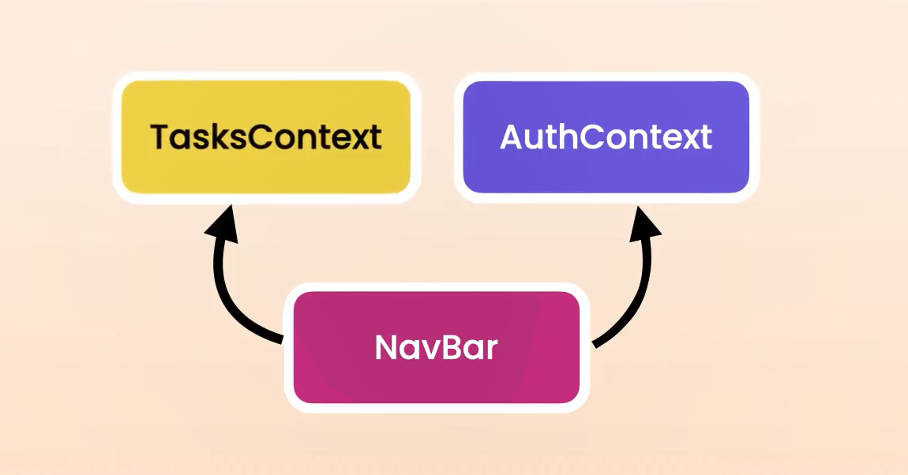

# React 18 Cheat sheet

## Topics

- React Query
- Global State Management
- React Router

# React Query part-one: Querying data

## Setting Up React Query

```cmd
npm i @tanstack/react-query@4.28
```

```tsx
// main.tsx
// PS: that query client is the core object we use for
// managing and caching remote data in react Query.
import { QueryClient, QueryClientProvider } from "@tanstack/react-query";

const queryClient = new QueryClient();

ReactDOM.createRoot(document.getElementById("root")!).render(
  <React.StrictMode>
    <QueryClientProvider client={queryClient}>
      <App />
    </QueryClientProvider>
  </React.StrictMode>
);
```

```tsx
const fetchTodos = () => {
  axios
    .get<Todos[]>("https://jsonplaceholder.typicode.com/todos")
    // returns a response object, we don't wanna store that
    .then((res) => res.data); // we wanna store the actual data
};

// That query object has a bunch of properties like: data, errors, isLoading...
const query = useQuery({
  queryKey: ["todos"],
  queryFn: fetchTodos,
});
```

Exp of use:

```tsx
const { data: todos, error } = useQuery<Todos[], Error>({
  queryKey: ["todos"],
  queryFn: fetchTodos,
});

return (
  <ul classname="list-group">
    {todos?.map((todo) => (
      <li key={todo.id} className="list-group-item">
        {todo.title}
      </li>
    ))}
  </ul>
);
```

    PS: With this implementation we get some benefits such as **`Automatics retries`**, **`Auto refetch`** and **`caching`**, we can configure all of those.

## Handling Error

```tsx
const { data: todos, error } = useQuery<Todos[], Error>({
  queryKey: ["todos"],
  queryFn: fetchTodos,
});

// error in an instance of error or null
if (error) return <p>{error.message}</p>;
// ...
```

## Loading indicator

```tsx
const {
  data: todos,
  error,
  isLoading,
} = useQuery<Todos[], Error>({
  queryKey: ["todos"],
  queryFn: fetchTodos,
});

if (isLoading) return <p>Loading...</p>;

if (error) return <p>{error.message}</p>;

// ...
```

## Creating a Custom Query Hook

```tsx
// useTodos hook
import axios from "axios";
import { useQuery } from "@tanstack/react-query";
import { Todos } from "../../services/todos-services";

const useTodos = () => {
  const fetchTodos = () =>
    axios
      .get<Todos[]>("https://jsonplaceholder.typicode.com/todos")
      .then((res) => res.data);

  // query object
  return useQuery<Todos[], Error>({
    queryKey: ["todos"],
    queryFn: fetchTodos,
  });
};

export default useTodos;
```

```tsx
// Our component
import useTodos from "../hooks/useTodos";

const TodosList = () => {
  const { data: todos, error, isLoading } = useTodos();

  if (isLoading) return <p>Loading...</p>;

  if (error) return <p>{error.message}</p>;

  return (/* ... */);
};

export default TodosList;
```

## react Query DevTools

```cmd
npm i @tanstack/react-query-devtools@4.28
```

```tsx
// main.tsx
// ...

const queryClinet = new QueryClient();

ReactDOM.createRoot(document.getElementById("root") as HTMLElement).render(
  <React.StrictMode>
    <QueryClientProvider client={queryClinet}>
      <RouterProvider router={router} />
      {/* <App /> */}
      <ReactQueryDevtools />{" "}
      {/* we add this component after the app component */}
    </QueryClientProvider>
  </React.StrictMode>
);
```

## Customizing Query Settings

```tsx
const queryClinet = new QueryClient({
  defaultOptions: {
    queries: {
      retry: 3, // default is 3
      cacheTime: 300_000, // default is 5m
      staleTime: 10 * 1000, // default is 10s
      refetchOnWindowFocus: false, // default value: true
      refetchOnReconnect: false, // default value: true
      refetchOnMount: false, // default value: true
      keepPreviousData: true, // default value: false
    },
  },
});
```

We can configure one Setting per query:

```tsx
// query object
return useQuery<Todos[], Error>({
  queryKey: ["todos"],
  queryFn: fetchTodos,
  staleTime: 10 * 1000, // 10Sec
});
```

## Parameterized Queries

```tsx
const [userId, setUserId] = useState<number>();
const { data: posts, error, isLoading } = usePosts(userId);
// ...

<select
  className="form-select mb-3"
  value={userId}
  onChange={(event) =>
    setUserId(
      isNaN(parseInt(event.target.value))
        ? undefined
        : parseInt(event.target.value)
    )
  }
>
  <option value=""></option>
  <option value="1">User 1</option>
  <option value="2">User 2</option>
  <option value="3">User 3</option>
</select>;
```

```tsx
const usePosts = (userId: number | undefined) => {
  // userId: is a number or undefined because initially no user is selected
  const fetchPosts = () => {
    return axios
      .get<Post[]>("https://jsonplaceholder.typicode.com/posts", {
        params: {
          userId,
        },
      })
      .then((res) => res.data);
  };

  return useQuery<Post[], Error>({
    // queryKey: ["users", userId, "posts"]
    // if no user is selected, better have an array with a single value
    queryKey: userId ? ["users", userId, "posts"] : ["posts"],
    queryFn: fetchPosts,
  });
};
```

## Paginated Queries

```tsx
interface PostQuery {
  page: number;
  pageSize: number;
}

const usePosts = (query: PostQuery) => {
  const fetchPosts = () => {
    return axios
      .get<Post[]>("https://jsonplaceholder.typicode.com/posts", {
        params: {
          _start: (query.page - 1) * query.pageSize,
          _limit: query.pageSize,
        },
      })
      .then((res) => res.data);
  };

  return useQuery<Post[], Error>({
    // anytime query changes, rq will fetch the data from the backend
    queryKey: ["posts", query],
    queryFn: fetchPosts,
    staleTime: 100 * 1000,
    keepPreviousData: true, // until new data arrives
  });
};
```

```tsx
const PostList = () => {
  const pageSize = 10;
  const [page, setPage] = useState(1);
  const { data: posts, error, isLoading } = usePosts({ page, pageSize });

  if (error) return <p>{error.message}</p>;
  if (isLoading) return <p>Loading...</p>;

  return (
    <>
      <ul className="list-group">
        {posts?.map((post) => (
          <li key={post.id} className="list-group-item">
            {post.userId} {"- "}
            {post.title}
          </li>
        ))}
      </ul>
      <button
        className="btn btn-primary my-3"
        onClick={() => setPage(page - 1)}
        disabled={page === 1}
      >
        Previous
      </button>
      <button
        className="btn btn-primary my-3 ms-1"
        onClick={() => setPage(page + 1)}
        // we don't know Nbr of pages, we won't implement disabled option
      >
        Next
      </button>
    </>
  );
};
```

## Infinite Queries

```tsx
interface PostQuery {
  pageSize: number;
}

const usePosts = (query: PostQuery) => {
  const fetchPosts = ({ pageParam = 1 }) => {
    return axios
      .get<Post[]>("https://jsonplaceholder.typicode.com/posts", {
        params: {
          _start: (pageParam - 1) * query.pageSize,
          _limit: query.pageSize,
        },
      })
      .then((res) => res.data);
  };

  return useInfiniteQuery<Post[], Error>({
    // anytime query changes, rq will fetch the data from the backend
    queryKey: ["posts", query],
    queryFn: fetchPosts,
    staleTime: 1 * 60 * 1000, // 1m
    keepPreviousData: true,
    getNextPageParam: (lastPage, allPages) => {
      // 1 -> 2
      return lastPage.length > 0 ? allPages.length + 1 : undefined;
      // PS: with JSON placeholder, if we ask data for a page that doesn't exist, we get an empty array.
      // undefined: will indicate that you reached the end of the list
    },
  });
};
```

```tsx
const PostList = () => {
  const pageSize = 10;
  // const [page, setPage] = useState(1); no need for this now
  // the infinit query that is return here has a func `fetchNextPage`
  const { data, error, isLoading, fetchNextPage, isFetchingNextPage } =
    usePosts({ pageSize });

  if (error) return <p>{error.message}</p>;
  if (isLoading) return <p>Loading...</p>;

  return (
    <ul className="list-group">
      {data.pages.map((page, index) => (
        // PS: don't forget the key attribute
        <Fragment key={index}>
          {page.map((post) => (
            <li key={post.id} className="list-group-item">
              {post.userId} {"- "}
              {post.title}
            </li>
          ))}
        </Fragment>
      ))}
    </ul>
    <button
      className="btn btn-primary my-3 ms-1"
      disabled={isFetchingNextPage}
      onClick={() => fetchNextPage()}
    >
      {/* to make the button dynamic */}
      {isFetchingNextPage ? "Loading..." : "Load More"}
    </button>
  );
};
```

# React Query part-two: Mutating data

## Mutating data

```tsx
import {
  QueryClient,
  useMutation,
  useQueryClient,
} from "@tanstack/react-query";
// ...

const TodoForm = () => {
  const queryClient = useQueryClient();
  const addTodo = useMutation({
    mutationFn: (todo: Todo) =>
      axios
        .post<Todo>("https://jsonplaceholder.typicode.com/todos", todo)
        .then((res) => res.data),
    onSuccess: (savedTodo, newTodo) => {
      // APPROACH 1: Invalidating cache
      // queryClient.invalidateQueries({
      //   queryKey: ["todos"],
      // });
      // APPROACH 2: Updating the data in the cache
      queryClient.setQueryData<Todo[]>(["todos"], (todos) => [
        savedTodo,
        ...(todos || []),
      ]);
    },
  });
  const ref = useRef<HTMLInputElement>(null);

  return (
    <form
      className="row mb-3"
      onSubmit={(event) => {
        event.preventDefault();
        if (ref.current && ref.current.value)
          addTodo.mutate({
            id: 0,
            title: ref.current?.value,
            userId: 1, // just an example
            completed: false,
          });
      }}
    >
      <div className="col">
        <input ref={ref} type="text" className="form-control" />
      </div>
      <div className="col">
        <button className="btn btn-primary">Add</button>
      </div>
    </form>
  );
};
```

## Handling Mutation Erros

```tsx
{
  addTodo.error && (
    <div className="alert alert-danger">{addTodo.error.message}</div>
  );
}
```

```tsx
const TodoForm = () => {
  const addTodo = useMutation<Todo, Error, Todo>({...
  //...
}
```

## Showing Mutation Progress

```tsx
<button disabled={addTodo.isLoading} className="btn btn-primary">
  {addTodo.isLoading ? "Adding..." : "Add"}
</button>
```

```tsx
// PS: to remove the value from the input field after submitting it
onSuccess: (savedTodo, newTodo) => {
  queryClient.setQueryData<Todo[]>(["todos"], (todos) => [
    savedTodo,
    ...(todos || []),
  ]);
  // PS: it can be null, check if it's truthy
  if (ref.current) ref.current.value = "";
},
```

## Optimistic updates

```tsx
import {
  QueryClient,
  useMutation,
  useQueryClient,
} from "@tanstack/react-query";
import { useRef } from "react";
import { Todo } from "../hooks/useTodos";
import axios from "axios";

interface AddTodoContext {
  prvsTodos: Todo[];
}

const TodoForm = () => {
  const queryClient = useQueryClient();
  const addTodo = useMutation<Todo, Error, Todo, AddTodoContext>({
    mutationFn: (todo: Todo) =>
      axios
        .post<Todo>("https://jsonplaceholder.typicode.com/todos", todo)
        .then((res) => res.data),
    onMutate: (newTodo: Todo) => {
      const prvsTodos = queryClient.getQueryData<Todo[]>(["todos"]) || [];
      queryClient.setQueryData<Todo[]>(["todos"], (todos) => [
        newTodo,
        ...(todos || []),
      ]);
      if (ref.current) ref.current.value = "";
      return { prvsTodos };
    },
    onSuccess: (savedTodo, newTodo) => {
      queryClient.setQueryData<Todo[]>(["todos"], (todos) =>
        todos?.map((todo) => (todo === newTodo ? savedTodo : todo))
      );
    },
    onError: (error, newTodo, context) => {
      if (!context) return;

      queryClient.setQueryData(["todos"], context.prvsTodos);
    },
  });
  const ref = useRef<HTMLInputElement>(null);

  return (
    <>
      {addTodo.error && (
        <div className="alert alert-danger">{addTodo.error.message}</div>
      )}
      <form
        className="row mb-3"
        onSubmit={(event) => {
          event.preventDefault();

          if (ref.current && ref.current.value)
            addTodo.mutate({
              id: 0, // generated on the server
              title: ref.current?.value,
              userId: 1, // just an example
              completed: false,
            });
        }}
      >
        <div className="col">
          <input ref={ref} type="text" className="form-control" />
        </div>
        <div className="col">
          <button className="btn btn-primary">
            {addTodo.isLoading ? "Adding..." : "Add"}
          </button>
        </div>
      </form>
    </>
  );
};

export default TodoForm;
```

## Creating a Custom Mutation Hook

```tsx
import { useMutation, useQueryClient } from "@tanstack/react-query";
import axios from "axios";
import { Todo } from "./useTodos";
import { CACHE_KEY_TODOS } from "../constants";

interface AddTodoContext {
  prvsTodos: Todo[];
}

const useAddTodo = (onAdd: () => void) => {
  const queryClient = useQueryClient();

  return useMutation<Todo, Error, Todo, AddTodoContext>({
    mutationFn: (todo: Todo) =>
      axios
        .post<Todo>("https://jsonplaceholder.typicode.com/todos", todo)
        .then((res) => res.data),

    onMutate: (newTodo: Todo) => {
      const prvsTodos = queryClient.getQueryData<Todo[]>(CACHE_KEY_TODOS) || [];
      queryClient.setQueryData<Todo[]>(CACHE_KEY_TODOS, (todos) => [
        newTodo,
        ...(todos || []),
      ]);

      onAdd();

      return { prvsTodos };
    },

    onSuccess: (savedTodo, newTodo) => {
      queryClient.setQueryData<Todo[]>(CACHE_KEY_TODOS, (todos) =>
        todos?.map((todo) => (todo === newTodo ? savedTodo : todo))
      );
    },
    onError: (error, newTodo, context) => {
      if (!context) return;
      queryClient.setQueryData(CACHE_KEY_TODOS, context.prvsTodos);
    },
  });
};

export default useAddTodo;
```

```tsx
// our Component
const TodoForm = () => {
  const ref = useRef<HTMLInputElement>(null);
  const addTodo = useAddTodo(() => {
    if (ref.current) ref.current.value = "";
  });

  return (
    <>
      {addTodo.error && (
        <div className="alert alert-danger">{addTodo.error.message}</div>
      )}
      <form
        className="row mb-3"
        onSubmit={(event) => {
          event.preventDefault();

          if (ref.current && ref.current.value)
            addTodo.mutate({
              id: 0, // generated on the server
              title: ref.current?.value,
              userId: 1, // just an example
              completed: false,
            });
        }}
      >
        <div className="col">
          <input ref={ref} type="text" className="form-control" />
        </div>
        <div className="col">
          <button disabled={addTodo.isLoading} className="btn btn-primary">
            {addTodo.isLoading ? "Adding..." : "Add"}
          </button>
        </div>
      </form>
    </>
  );
};
```

```tsx
import { useMutation, useQueryClient } from "@tanstack/react-query";
import axios from "axios";
import { Todo } from "./useTodos";
import { CACHE_KEY_TODOS } from "../constants";

interface AddTodoContext {
  prvsTodos: Todo[];
}

const useAddTodo = (onAdd: () => void) => {
  const queryClient = useQueryClient();

  return useMutation<Todo, Error, Todo, AddTodoContext>({
    mutationFn: (todo: Todo) =>
      axios
        .post<Todo>("https://jsonplaceholder.typicode.com/todos", todo)
        .then((res) => res.data),

    onMutate: (newTodo: Todo) => {
      const prvsTodos = queryClient.getQueryData<Todo[]>(CACHE_KEY_TODOS) || [];
      queryClient.setQueryData<Todo[]>(CACHE_KEY_TODOS, (todos) => [
        newTodo,
        ...(todos || []),
      ]);

      onAdd();

      return { prvsTodos };
    },

    onSuccess: (savedTodo, newTodo) => {
      queryClient.setQueryData<Todo[]>(CACHE_KEY_TODOS, (todos) =>
        todos?.map((todo) => (todo === newTodo ? savedTodo : todo))
      );
    },
    onError: (error, newTodo, context) => {
      if (!context) return;
      queryClient.setQueryData(CACHE_KEY_TODOS, context.prvsTodos);
    },
  });
};

export default useAddTodo;
```

## Creating a Reusable API Client

```tsx
// apiClinet.ts
import axios from "axios";

const axiosInstance = axios.create({
  baseURL: "https://jsonplaceholder.typicode.com",
});

class APIClient<T> {
  endpoint: string;

  constructor(endpoint: string) {
    this.endpoint = endpoint;
  }

  getAll = () => {
    debugger; // to debug when it gets to here
    return axiosInstance.get<T[]>(this.endpoint).then((res) => res.data);
  };

  // post is a generic method that take objects of type T
  post = (data: T) => {
    return axiosInstance.post<T>(this.endpoint, data).then((res) => res.data);
  };
}

export default APIClient;
```

```tsx
// useTodos.ts
import { useQuery } from "@tanstack/react-query";
import APIClient from "../services/apiClient";
import { CACHE_KEY_TODOS } from "../constants";

const apiClient = new APIClient<Todo>("/todos");

export interface Todo {
  id: number;
  title: string;
  userId: number;
  completed: boolean;
}

const useTodos = () => {
  return useQuery<Todo[], Error>({
    queryKey: CACHE_KEY_TODOS,
    queryFn: apiClient.getAll, // we change the queryFn here
    staleTime: 100 * 1000,
    keepPreviousData: true,
  });
};

export default useTodos;
```

```tsx
// useAddTodo.ts
import APIClient from "../services/apiClient";
// ...

const apiClinet = new APIClient<Todo>("/todos");

interface AddTodoContext {
  prvsTodos: Todo[];
}

const useAddTodo = (onAdd: () => void) => {
  const queryClient = useQueryClient();

  // we cahnge the mutation function here
  return useMutation<Todo, Error, Todo, AddTodoContext>({
    mutationFn: apiClinet.post,
    // ...
    // ...
```

## Creating a Reusable HTTP Service

```tsx
import APIClient from "./apiClient";

export interface Todo {
  id: number;
  title: string;
  userId: number;
  completed: boolean;
}

export default new APIClient<Todo>("/todos");
```

PS: don't forget to import the Todo interface.

```tsx
// useTodos
// we change the import statement
import todoService, { Todo } from "../services/todoService";

const useTodos = () => {
  return useQuery<Todo[], Error>({
    queryKey: CACHE_KEY_TODOS,
    queryFn: todoService.getAll, // we change it here too
    staleTime: 100 * 1000,
    keepPreviousData: true,
  });
};

export default useTodos;
```

```tsx
// we import the todoService
import todoService, { Todo } from "../services/todoService";

interface AddTodoContext {
  prvsTodos: Todo[];
}

const useAddTodo = (onAdd: () => void) => {
  const queryClient = useQueryClient();

  return useMutation<Todo, Error, Todo, AddTodoContext>({
    mutationFn: todoService.post, // we change the obj name here
```

## Application Layers

Let's take a closer look at the pieces in our apllication and how they work together.


**API Clinet:** The bottom layer, Handle HTTP request for the backend.

**HTTP Services:** Instances of our API Client dedicating to working with specific type of objects. for exp we have a todo service for working with todos, we can also have a post service for working with posts.

**Custom Hooks:** Above those layers we have this costum hook, which use HTTP Servies to fetch and update Data, in these hooks we have all the logic for managing data in the cache.

**Component:** at the top we have our component which use our hooks to fetch and update data.

The beutiful here is that each layer in this application has a single responsibility resulting in a clear and well orginized architecture. by breaking down our application these different layers we can easily manage and maintain our code, reduce duplication and improve scalability.

# Global State Management: Part one

## Consolidating State Logic with a Reducer

```tsx
// inside 'reducers' folder: counterReducer.tsx
interface Action {
  type: "INCREMENT" | "RESET";
}

// PS: annotate the func to detect potential errors when returning a value
const counterReducer = (state: number, action: Action): number => {
  if (action.type === "INCREMENT") return state + 1;
  if (action.type === "RESET") return 0;
  return state;
};

export default counterReducer;
```

```tsx
// Counter.tsx
import { useReducer, useState } from "react";
import counterReducer from "./reducers/counterReducer";

const Counter = () => {
  // const [value, setValue] = useState(0);
  const [value, dispatch] = useReducer(counterReducer, 0);

  return (
    <div>
      Counter ({value})
      <button
        onClick={() => dispatch({ type: "INCREMENT" })}
        className="btn btn-primary mx-1"
      >
        Increment
      </button>
      <button
        onClick={() => dispatch({ type: "RESET" })}
        className="btn btn-primary mx-1"
      >
        Reset
      </button>
    </div>
  );
};

export default Counter;
```

## Creating Complex Actions

```tsx
// we defined two interfaces to cover both type of actions
// like that each interface has a different type of payload
interface AddTask {
  type: "ADD";
  task: Task;
}
interface DeleteTask {
  type: "DELETE";
  taskId: number;
}

// we define a type called Action which is a union of the two interfaces.
// so the action can be either AddTask or DeleteTask
type Action = AddTask | DeleteTask;
```

```tsx
//
// tasksReducer
//
// we moved this interface from the component to our reducer
interface Task {
  id: number;
  title: string;
}

// we defined two interfaces to cover both type of actions
// like that each interface has a different type of payload
interface AddTask {
  type: "ADD";
  task: Task;
}
interface DeleteTask {
  type: "DELETE";
  taskId: number;
}
type Action = AddTask | DeleteTask;

// we renamed "state" to "tasks" for clarity
const taskReducer = (tasks: Task[], action: Action): Task[] => {
  // we used a switch statement instead o bunch of if statements
  switch (action.type) {
    case "ADD":
      return [action.task, ...tasks];
    case "DELETE":
      return tasks.filter((task) => action.taskId !== task.id);
    default:
      return tasks;
  }
};

export default taskReducer;
```

```tsx
//
// taskList component
//
import { useReducer } from "react";
import taskReducer from "./reducers/tasksReducer";

const TaskList = () => {
  const [tasks, dispatch] = useReducer(taskReducer, []);

  return (
    <>
      <button
        onClick={() =>
          dispatch({
            type: "ADD",
            task: { id: Date.now(), title: "Task " + Date.now() },
          })
        }
        className="btn btn-primary my-3"
      >
        Add Task
      </button>
      <ul className="list-group">
        {tasks.map((task) => (
          <li
            key={task.id}
            className="list-group-item d-flex justify-content-between align-items-center"
          >
            <span className="flex-grow-1">{task.title}</span>
            <button
              className="btn btn-outline-danger"
              onClick={() =>
                dispatch({
                  type: "DELETE",
                  taskId: task.id,
                })
              }
            >
              Delete
            </button>
          </li>
        ))}
      </ul>
    </>
  );
};

export default TaskList;
```

## Sharing State using Context

```tsx
// TasksContext.ts file
import { createContext } from "react";
import { Task, TaskAction } from "../reducers/tasksReducer";

interface TasksContextType {
  tasks: Task[];
  dispatch: React.Dispatch<TaskAction>;
}

const TasksContext = createContext({} as TasksContextType);

export default TasksContext;
```

```tsx
// App component
import { useReducer } from "react";
import "./App.css";
import TaskContext from "./state-management/contexts/TasksContext";
import taskReducer from "./state-management/reducers/tasksReducer";
import HomePage from "./state-management/HomePage";
import NavBar from "./state-management/NavBar";

function App() {
  const [tasks, dispatch] = useReducer(taskReducer, []);

  return (
    <TaskContext.Provider value={{ tasks, dispatch }}>
      <NavBar />
      <HomePage />
    </TaskContext.Provider>
  );
}

export default App;
```

```tsx
// TaskList component
import { useContext } from "react";
import TaskContext from "./contexts/TasksContext";

const TaskList = () => {
  // const [tasks, dispatch] = useReducer(taskReducer, []);
  const { tasks, dispatch } = useContext(TaskContext);

// the rest is the same
// ...
// ..
// .
```

## Creating a Custom Provider

```tsx
// AuthProvider.tsx
import { ReactNode, useReducer } from "react";
import AuthReducer from "../reducers/logInReducer";
import AuthContext from "../contexts/UserContext";

interface Props {
  children: ReactNode;
}

const AuthProvider = ({ children }: Props) => {
  // we can rename it into dispatch because it's the only dispatch func
  const [user, dispatch] = useReducer(AuthReducer, "");
  return (
    <AuthContext.Provider value={{ user, dispatch }}>
      {children}
    </AuthContext.Provider>
  );
};

export default AuthProvider;
```

```tsx
// TaskProvider.tsx
import { ReactNode, useReducer } from "react";
import taskReducer from "../reducers/tasksReducer";
import TasksContext from "../contexts/TasksContext";

interface Props {
  children: ReactNode;
}
function TaskProvider({ children }: Props) {
  const [tasks, dispatch] = useReducer(taskReducer, []);

  return (
    <TasksContext.Provider value={{ tasks, dispatch }}>
      {children}
    </TasksContext.Provider>
  );
}

export default TaskProvider;
```

```tsx
// App.tsx
import "./App.css";
import HomePage from "./state-management/HomePage";
import NavBar from "./state-management/NavBar";
import AuthProvider from "./state-management/providers/AuthProvider";
import TaskProvider from "./state-management/providers/TaskProvider";

function App() {
  return (
    <TaskProvider>
      <AuthProvider>
        <NavBar />
        <HomePage />
      </AuthProvider>
    </TaskProvider>
  );
}

export default App;
```

```tsx
// TaskList component
import { useContext } from "react";
import TaskContext from "./contexts/TasksContext";

const TaskList = () => {
  // const [tasks, dispatch] = useReducer(taskReducer, []);
  const { tasks, dispatch } = useContext(TaskContext);

// the rest is the same
// ...
// ..
// .
```

## Creating a Hook to Access Context

```tsx
// Auth Hook (useAuth.ts)
import { useContext } from "react";
import AuthContext from "../contexts/UserContext";

const useAuth = () => useContext(AuthContext);

export default useAuth;
```

```tsx
// LoginStatus component
import useAuth from "./hooks/useAuth";

const LoginStatus = () => {
  const { user, dispatch } = useAuth();
  // ...
  // ...
```

## Organizing Code for Scalability and Maintainabilityc

## Summary

The tutorial explains how to organize code by encapsulating related components, hooks, and reducers into a single module or package to make the code more modular, scalable, and maintainable. The key steps include:

1. **Moving Related Files:** All files related to tasks (context, custom hook, reducer, and components) are moved into a single "tasks" folder.

2. **Combining Reducer and Provider:** The reducer code is moved into the `TasksProvider` file, making it an internal implementation detail that doesn't need to be exported or accessed elsewhere.

3. **Simplifying Hook Usage:** The custom hook, previously in a separate file, is integrated directly into the `TaskList` component since it’s only used there.

4. **Creating an Index File:** An `index.ts` file is added to the package to expose only the necessary components (`TasksProvider` and `TaskList`) as the public interface, while keeping other implementation details hidden.

**End Result:** The code is now more organized, with all task-related components in one folder, and only the necessary parts are exposed for use in other parts of the application. This structure makes future changes easier and ensures the rest of the application is unaffected by internal modifications.

## Splitting Contexts for Efficiency

- Context re-renders components whenever it changes, so it should only hold closely related values.
- Example: separating "tasks" and "auth" contexts prevents unnecessary re-renders in the navigation bar.
- Use smaller, focused contexts to avoid inefficient re-renders.
- Avoid over-complicating by creating too many contexts (e.g., splitting state and dispatch).
- Tasks and their update functions are closely related and should not be separated.
- React context is effective when used correctly; misuse leads to unnecessary complexity.



## When to use Context

- **Redux** is a state management tool that uses a centralized store to manage application state, preventing prop drilling.
- **Context** can also avoid prop drilling but isn’t a state management tool, it’s a method for sharing and transporting state.
- Redux offers advanced features like caching server state, persisting state, undo functionality, and action logging.
- Some developers argue that Redux adds unnecessary complexity and boilerplate code. Tools like **Redux Toolkit** reduce this, but they may still be overkill for simple applications.
- For **server state** management, tools like **React Query** are more suitable, requiring fewer concepts like queries and mutations.
- For **client state**, local state with context or simpler tools like **Zustand** are often enough. Zustand provides more control without Redux’s complexity.
- The conclusion is that Redux is no longer essential for many projects, and alternatives like React Query and Zustand simplify state management without adding unnecessary overhead.


# Global State Management: Part two

## Managing Application State with Zustand

```tsx
npm i zustand@4.3.7
```

```tsx
// store.ts
interface CounterStore {
  counter: number;
  increament: () => void;
  resetr: () => void;
}

const useCounterStore = create<CounterStore>((set) => ({
  counter: 0,
  increament: () => set((store) => ({ counter: store.counter + 1 })),
  reset: () => set(() => ({ counter: 0 })),
}));

export default useCounterStore;
```

```tsx
import useCounterStore from "./store";

const Counter = () => {
  const { counter, increament, reset } = useCounterStore();

  return (
    <div>
      Counter ({counter})
      <button
        // onClick={() => dispatch({ type: "INCREMENT" })}
        onClick={() => increament()}
        className="btn btn-primary mx-1"
      >
        Increment
      </button>
      <button
        // onClick={() => dispatch({ type: "RESET" })}
        onClick={() => reset()}
        className="btn btn-primary mx-1"
      >
        Reset
      </button>
    </div>
  );
};

export default Counter;
```

```tsx
import LoginStatus from "./auth/LoginStatus";
import useCounterStore from "./counter/store";

const NavBar = () => {
  const { counter } = useCounterStore();

  return (
    <nav className="navbar d-flex justify-content-between">
      <span className="badge text-bg-secondary">{counter}</span>
      <LoginStatus />
    </nav>
  );
};

export default NavBar;
```

## Preventing Unnecessary Renders in React with State Management

- **Objective**: Prevent unnecessary re-renders of components in React when using state management tools.

- **Store Setup**:

  - Add a `max` property (initialized to 5) in the `counter` store.
  - Modify the `reset` function to set `max` to 10 instead of resetting `counter` (for demonstration purposes).

- **NavBar Component**:

  - Add `console.log("Render NavBar")` to observe re-renders.
  - Current implementation causes `NavBar` to re-render whenever any property in the `counter` store changes (e.g., when `counter` or `max` changes).

- **Optimization Using Selectors**:

  - To prevent `NavBar` from re-rendering when `max` changes, use a **selector** that extracts only the `counter` property.
  - Pass an arrow function like `s => s.counter` to the hook to make the component dependent solely on the `counter` property.

- **Result**:
  - `NavBar` re-renders only when `counter` changes.
  - Changes to `max` no longer trigger a re-render, optimizing performance.

## Inspecting Stores with Zustand DevTools

When building applications, it's often necessary to inspect our store, especially when something isn’t working as expected. Fortunately, there's a library called **simple-zustand-devtools** that allows us to do this. This library integrates with React DevTools, making it easy to inspect and debug our Zustand stores. Let me show you how to set it up.

### Steps to Set Up:

1. **Install the Library**:

   - Open your terminal and run the following command:
     ```bash
     npm install simple-zustand-devtools@1.1.0
     ```

2. **Import the Function**:

   - In your store file (e.g., in the `counter` folder), import the `mountStoreDevtool` function at the top of the file:
     ```typescript
     import { mountStoreDevtool } from "simple-zustand-devtools";
     ```

3. **Check Development Environment**:

   - Before exporting your custom hook, check if you're in a development environment by using the `process.env.NODE_ENV` variable, which is a property of the Node.js `process` object. However, TypeScript might complain because it doesn’t recognize the `process` object by default. To fix this, install the type declarations for Node.js:
     ```bash
     npm install --save-dev @types/node
     ```

4. **Add DevTools Setup**:

   - Back in the store file, add the following code before the export statement:

     ```typescript
     if (process.env.NODE_ENV === "development") {
       mountStoreDevtool("Counter Store", useCounterStore);
     }
     ```

   - **Explanation**:
     - We check if `NODE_ENV` is set to `development`. This ensures that DevTools are only activated in development mode.
     - If true, we call `mountStoreDevtool` and pass two arguments:
       - The first argument is the name we want to give to our store, which will appear in React DevTools. In this case, we use "Counter Store".
       - The second argument is our custom hook, `useCounterStore`, which represents the store we want to inspect.

5. **Testing**:
   - Open your browser and go to the React DevTools.
   - Navigate to the **Components** tab, and you should see "Counter Store" listed. If you select it, you can inspect the contents of the store, including the `counter` property and the `increment` function.
   - You can even modify the values directly from DevTools. For example, setting the `counter` to 10 will cause your components to re-render with the new state.

### Result:

You’ve now successfully integrated Zustand DevTools into your application, making debugging much easier.

# Routing with React Router

## Setting Up Routing

```cmd
npm i react-router-dom@6.10.0
```

```tsx
// main
// ...
// ...

const queryClinet = new QueryClient();

ReactDOM.createRoot(document.getElementById("root") as HTMLElement).render(
  <React.StrictMode>
    <QueryClientProvider client={queryClinet}>
      <RouterProvider router={router} />
      {/* <App /> */}
      <ReactQueryDevtools />
    </QueryClientProvider>
  </React.StrictMode>
);
```

```tsx
// routes.tsx
import { createBrowserRouter } from "react-router-dom";
import HomePage from "./HomePage";
import UserListPage from "./UserListPage";

const router = createBrowserRouter([
  { path: "/", element: <HomePage /> },
  { path: "/users", element: <UserListPage /> },
]);

export default router;
```

## Passing Data with Route Parameters

```tsx
//
// ...

const router = createBrowserRouter([
  { path: "/", element: <HomePage /> },
  { path: "/contact", element: <ContactPage /> },
  { path: "/users", element: <UserListPage /> },
  { path: "/users/:id", element: <UserDetailPage /> },
  // you can pass many paramaeters
  // { path: "/posts/:year/:month", element: <UserListPage /> },
]);

export default router;
```

```tsx
import { Link } from "react-router-dom";

const UserListPage = () => {
  const users = [
    { id: 1, name: "Mosh" },
    { id: 2, name: "John" },
    { id: 3, name: "Alice" },
  ];
  return (
    <ul className="list-group">
      {users.map((user) => (
        <li className="list-group-item" key={user.id}>
          <Link to={`/users/${user.id}`}>{user.name}</Link>
          {/* <a href="#">{user.name}</a> */}
        </li>
      ))}
    </ul>
  );
};

export default UserListPage;
```

## Getting Data about the Current Route

```tsx
import { useLocation, useParams, useSearchParams } from "react-router-dom";

const UserDetailPage = () => {
  const params = useParams();
  console.log(params);
  // {id: '2'}
  // ps: that 2 value is a string be carefull

  const [searchParams, setSearchParams] = useSearchParams();
  // with this we can access and update the query string parameter
  console.log(searchParams); // URLSearchParams {size: 0}
  // not empty, this is the default way of rendering
  //
  // http://localhost:5173/users/2?name=alice&age=25
  // console.log(searchParams.toString()); // name=alice&age=25
  // console.log(searchParams.get("name")); // alice
  //
  // PS: our component should be pure, we should be carefull wehen using "setSearchParams"
  // we should call it only inside event handlers or inside an effect
  //

  const location = useLocation();
  // access the current location
  console.log(location);
  // {
  //   pathname: '/users/2',
  //   search: '?name=alice&age=25',
  //   hash: '',
  //   state: null,
  //   key: '4mf7y6pp'
  // }

  return <p>User</p>;
};

export default UserDetailPage;
```

## Nested Routes

```tsx
// routes.tsx
import { createBrowserRouter } from "react-router-dom";
import HomePage from "./HomePage";
import UserListPage from "./UserListPage";
import ContactPage from "./ContactPage";
import UserDetailPage from "./UserDetailPage";
import Layout from "./Layout";

const router = createBrowserRouter([
  {
    path: "/",
    element: <Layout />,
    children: [
      { index: true, element: <HomePage /> },
      { path: "contact", element: <ContactPage /> },
      { path: "users", element: <UserListPage /> },
      { path: "users/:id", element: <UserDetailPage /> },
    ],
  },
]);

export default router;
```

```tsx
// Layout component (parent component)
import { Outlet } from "react-router-dom";
import NavBar from "./NavBar";

const Layout = () => {
  return (
    <>
      <NavBar />
      <div id="main">
        <Outlet />
        {/* Outlet is like a placeholder for a child component */}
      </div>
    </>
  );
};

export default Layout;
```

```tsx
// NavBar component
import { Link } from "react-router-dom";

const NavBar = () => {
  return (
    <nav
      className="navbar navbar-expand-lg"
      style={{ background: "#f0f0f0", marginBottom: "1rem" }}
    >
      <div className="container-fluid">
        <a className="navbar-brand" href="#">
          My App
        </a>
        <div className="collapse navbar-collapse" id="navbarNav">
          <ul className="navbar-nav">
            <li className="nav-item">
              {/* we have to replace the anchors with Link component 
              <a className="nav-link active" href="#">
                Home
              </a> */}
              <Link to="/" className="nav-link">
                Home
              </Link>
            </li>
            <li className="nav-item">
              <Link to="/users" className="nav-link">
                Users
              </Link>
            </li>
          </ul>
        </div>
      </div>
    </nav>
  );
};

export default NavBar;
```

## Styling the Active Link

```tsx
// ul element in the Nav component
<ul className="navbar-nav">
  <li className="nav-item">
    {/* we have to replace the anchors with Link component
              <a className="nav-link active" href="#">
                Home
              </a> */}
    {/* in case you want to change the name of the active class */}
    <NavLink
      to="/"
      className={({ isActive }) => (isActive ? "active nav-link" : "nav-link")}
    >
      Home
    </NavLink>
  </li>
  <li className="nav-item">
    <NavLink to="/users" className="nav-link">
      Users
    </NavLink>
  </li>
</ul>
```

## Handling Errors

```tsx
import { createBrowserRouter } from "react-router-dom";
import HomePage from "./HomePage";
import UserListPage from "./UserListPage";
import ContactPage from "./ContactPage";
import UserDetailPage from "./UserDetailPage";
import Layout from "./Layout";
import ErrorPage from "./ErrorPage";

const router = createBrowserRouter([
  {
    path: "/",
    element: <Layout />,
    errorElement: <ErrorPage />, // handle not found errors
    children: [
      // ....
    ],
  },
]);

export default router;
```

```tsx
import { isRouteErrorResponse, useRouteError } from "react-router-dom";

const ErrorPage = () => {
  const error = useRouteError();
  console.log(error);

  return (
    <>
      <h1>Oops...</h1>
      <p>
        {/* to tell the user this page donesn't exist
         if true, user tried to access invalid browser */}
        {isRouteErrorResponse(error)
          ? "Invalid Page"
          : "Sorry, an unexpected error has occurred."}
      </p>
    </>
  );
};

export default ErrorPage;
```

## Private Routes

```tsx
// useAuth.ts
// this is just a demo it is not a real world example
// const useAuth = () => ({ user: { id: 1, name: 'Mosh' } });

const useAuth = () => ({ user: null });

export default useAuth;
```

```tsx
// UserPage
const UsersPage = () => {
  const { user } = useAuth();

  if (!user) return <Navigate to="/login" />;

  return (
    <div className="row">
      <div className="col">
        <UserList />
      </div>
      <div className="col">
        <Outlet />
      </div>
    </div>
  );
};

export default UsersPage;
```

```tsx
// routes.tsx
const router = createBrowserRouter([
  {
    path: "/",
    element: <Layout />,
    errorElement: <ErrorPage />, // handle not found errors
    children: [
      { index: true, element: <HomePage /> },
      { path: "login", element: <LoginPage /> },
      {
        path: "users",
        element: <UsersPage />,
        children: [{ path: ":id", element: <UserDetail /> }],
      },
    ],
  },
]);
export default router;
```

## Layout Routes

Sometimes we need to group routes for enforcing layouts or buissnes rules, this is where we can use the `Layout` routes.

```tsx
import useAuth from "./hooks/useAuth";
import { Navigate, Outlet } from "react-router-dom";

const PrivateRoutes = () => {
  const { user } = useAuth();

  if (!user) return <Navigate to="/login" />;

  return <Outlet />;
};

export default PrivateRoutes;
```

```tsx
import { Outlet } from "react-router-dom";
import UserList from "./UserList";

const UsersPage = () => {
  // const { user } = useAuth();
  // if (!user) return <Navigate to={"/login"} />;

  return (
    <div className="row">
      <div className="col">
        <UserList />
      </div>
      <div className="col">
        <Outlet />
      </div>
    </div>
  );
};

export default UsersPage;
```

```tsx
// Routes
import { createBrowserRouter } from "react-router-dom";
import ErrorPage from "./ErrorPage";
import HomePage from "./HomePage";
import Layout from "./Layout";
import LoginPage from "./LoginPage";
import PrivateRoutes from "./PrivateRoutes";
import UserDetail from "./UserDetail";
import UsersPage from "./UsersPage";

const router = createBrowserRouter([
  {
    path: "/",
    element: <Layout />,
    errorElement: <ErrorPage />, // handle not found errors
    children: [
      // PS: path to this routes should be relative to the path of theire parent
      // no need for a slash here

      // PS 2: since the string of the path is null, we remove that property
      // and add index prop to true, means if the user is on the location
      // of the parent, that's the default component that should be
      // rendered inside the outlet
      { index: true, element: <HomePage /> },
      { path: "login", element: <LoginPage /> },
    ],
  },
  {
    // no need to set path, this is a layout route, its purpose
    // is to group routes for enforcing layout or buissnes rules
    element: <PrivateRoutes />,
    children: [
      {
        path: "users",
        element: <UsersPage />,
        children: [{ path: ":id", element: <UserDetail /> }],
      },
    ],
  },
]);

export default router;
```
